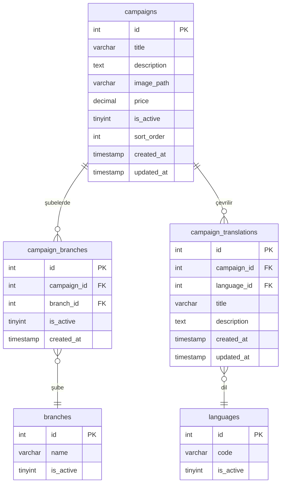
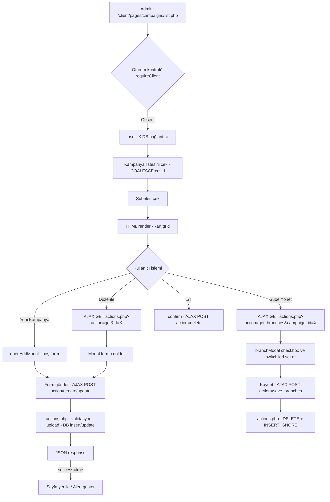
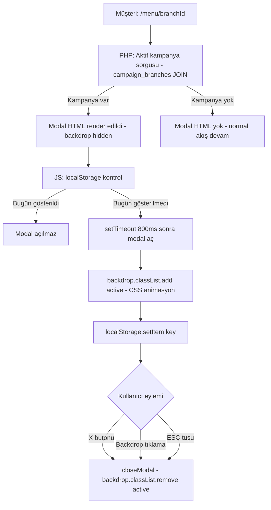

# Kampanyalar Modülü — Mimari Plan
## QR Menu SaaS — PHP 8 / Bootstrap 5 / MySQL

> **Durum:** Tasarım / Onay Aşaması  
> **Hedef:** Admin panelde kampanya CRUD + menüde modal popup gösterimi  
> **Referans Analizi:** `categories` modülü pattern'ı baz alınmıştır.

---

## 1. Veritabanı Tasarımı

Her kullanıcının kendi `user_{id}` veritabanı var. Yeni tablolar da bu pattern'a uyar.  
Migration scripti tüm mevcut `user_{id}` DB'lerini günceller (bkz. Bölüm 6).

---

### 1.1 Tablo: `campaigns`

Ana kampanya kaydı.

```sql
CREATE TABLE IF NOT EXISTS `campaigns` (
    `id`          INT(11)       NOT NULL AUTO_INCREMENT,
    `title`       VARCHAR(255)  NOT NULL,
    `description` TEXT          DEFAULT NULL,
    `image_path`  VARCHAR(500)  DEFAULT NULL,
    `price`       DECIMAL(10,2) DEFAULT NULL,   -- NULL ise menüde fiyat gösterilmez
    `is_active`   TINYINT(1)    NOT NULL DEFAULT 1,
    `sort_order`  INT(11)       NOT NULL DEFAULT 0,
    `created_at`  TIMESTAMP     NOT NULL DEFAULT CURRENT_TIMESTAMP,
    `updated_at`  TIMESTAMP     NULL     DEFAULT NULL ON UPDATE CURRENT_TIMESTAMP,
    PRIMARY KEY (`id`)
) ENGINE=InnoDB DEFAULT CHARSET=utf8mb4 COLLATE=utf8mb4_unicode_ci;
```

**Alan Açıklamaları:**
- `title` — Admin panelde girilen varsayılan başlık (fallback, çeviri yoksa kullanılır)
- `description` — Varsayılan açıklama (fallback)
- `image_path` — `uploads/campaigns/user_{id}/{filename}` formatında göreli yol
- `price` — NULL ise modal'da fiyat satırı render edilmez (Gereksinim #6)
- `is_active` — Genel aktiflik; şube bazlı aktiflik `campaign_branches` tablosunda

---

### 1.2 Tablo: `campaign_branches`

Hangi kampanyanın hangi şubede aktif olduğunu tutar.  
`categories` modülündeki `category_branches` ile birebir aynı pattern.

```sql
CREATE TABLE IF NOT EXISTS `campaign_branches` (
    `id`          INT(11)    NOT NULL AUTO_INCREMENT,
    `campaign_id` INT(11)    NOT NULL,
    `branch_id`   INT(11)    NOT NULL,
    `is_active`   TINYINT(1) NOT NULL DEFAULT 1,
    `created_at`  TIMESTAMP  NOT NULL DEFAULT CURRENT_TIMESTAMP,
    PRIMARY KEY (`id`),
    UNIQUE KEY `uq_campaign_branch` (`campaign_id`, `branch_id`),
    CONSTRAINT `fk_cb_campaign` FOREIGN KEY (`campaign_id`) REFERENCES `campaigns`(`id`) ON DELETE CASCADE
) ENGINE=InnoDB DEFAULT CHARSET=utf8mb4 COLLATE=utf8mb4_unicode_ci;
```

**Mantık:**
- Kampanya oluşturulunca tüm aktif şubelere otomatik atanır (`is_active = 1`) — categories'deki aynı pattern
- Admin "Şube Yönet" butonuyla per-şube `is_active` toggle eder
- Menü sorgusu: `campaigns c INNER JOIN campaign_branches cb ON c.id = cb.campaign_id WHERE cb.branch_id = :branch_id AND cb.is_active = 1 AND c.is_active = 1`

---

### 1.3 Tablo: `campaign_translations`

Kampanya başlık ve açıklamasının çok dil desteği için. Mevcut `translations` tablosundan bağımsız, kampanyaya özel bir tablo.

```sql
CREATE TABLE IF NOT EXISTS `campaign_translations` (
    `id`          INT(11)      NOT NULL AUTO_INCREMENT,
    `campaign_id` INT(11)      NOT NULL,
    `language_id` INT(11)      NOT NULL,    -- languages tablosundaki id (user_{id}.languages)
    `title`       VARCHAR(255) DEFAULT NULL,
    `description` TEXT         DEFAULT NULL,
    `created_at`  TIMESTAMP    NOT NULL DEFAULT CURRENT_TIMESTAMP,
    `updated_at`  TIMESTAMP    NULL     DEFAULT NULL ON UPDATE CURRENT_TIMESTAMP,
    PRIMARY KEY (`id`),
    UNIQUE KEY `uq_campaign_lang` (`campaign_id`, `language_id`),
    CONSTRAINT `fk_ct_campaign` FOREIGN KEY (`campaign_id`) REFERENCES `campaigns`(`id`) ON DELETE CASCADE
) ENGINE=InnoDB DEFAULT CHARSET=utf8mb4 COLLATE=utf8mb4_unicode_ci;
```

**Kullanım:**  
Menüde `LEFT JOIN campaign_translations ct ON ct.campaign_id = c.id AND ct.language_id = {$selectedLangId}` ile `COALESCE(ct.title, c.title)` ile çeviri alınır.  
Admin panelde translations sayfasından çeviri girilebilir (bkz. Bölüm 5.2).

---

### 1.4 ER Diyagramı



---

## 2. Dosya Listesi

```
database/
  migration_add_campaigns.php            ← Yeni: 3 tabloyu user_{id} DB'lerine ekler

client/
  components/
    sidebar/
      sidebar.php                         ← Güncelleme: kampanyalar menü öğesi eklenir

  config/
    lang/
      tr.php                              ← Güncelleme: kampanya çeviri anahtarları
      en.php                              ← Güncelleme: kampanya çeviri anahtarları

  pages/
    campaigns/
      list.php                            ← Yeni: Kampanya listesi + CRUD modalları
      actions.php                         ← Yeni: Backend CRUD + upload + şube atama
      list.js                             ← Yeni: AJAX, modal yönetimi, form submit
      list.css                            ← Yeni: Kampanya kartı stilleri

uploads/
  campaigns/
    user_1/                               ← Otomatik oluşturulur (actions.php tarafından)
    user_2/
    ...                                   ← Her kullanıcı için ayrı klasör

menu/
  index.php                              ← Güncelleme: kampanya sorgusu + modal HTML eklenir
  assets/
    css/
      menu.css                            ← Güncelleme: .campaign-modal stilleri
    js/
      menu.js                             ← Güncelleme: modal aç/kapat + localStorage kontrolü
```

---

## 3. Admin Panel Akışı

### 3.1 Genel Yapı — `client/pages/campaigns/list.php`

**PHP başlangıcı (categories/list.php ile aynı pattern):**
```
requireClient() → $userId → switchDatabase("user_{$userId}") →
Lang::loadFromDB() → kampanya listesini çek (panel diline göre COALESCE) →
şubeleri çek → user bilgisini al
```

**Kampanya Listeleme Sorgusu:**
```sql
SELECT c.*,
       COALESCE(ct.title,       c.title)       AS display_title,
       COALESCE(ct.description, c.description) AS display_description
FROM campaigns c
LEFT JOIN campaign_translations ct
       ON ct.campaign_id = c.id AND ct.language_id = {$_langId}
ORDER BY c.sort_order ASC, c.id DESC
```

**Sayfa Düzeni:**
- Navbar + Sidebar (2 kolon / 10 kolon Bootstrap grid)
- Başlık: `<i class="fas fa-bullhorn">` + `Lang::h('campaigns_management')`
- Sağ üstte: `+ Yeni Kampanya` butonu
- Kart grid görünümü (col-md-6 col-lg-4) — list.php'deki categories kart yapısına benzer
- Her kartta: kampanya resmi, başlık, fiyat rozeti, aktif/pasif badge, Düzenle / Şube / Sil butonları

---

### 3.2 Ekleme / Düzenleme Modal Formu

**Modal ID:** `#campaignModal` | **Boyut:** `modal-lg`

**Form Alanları (Sol Kolon):**
| Alan | Tip | Zorunlu | Not |
|---|---|---|---|
| `title` | `text` | Evet | max 255 karakter |
| `description` | `textarea` rows=4 | Hayır | — |
| `price` | `number` step=0.01 min=0 | Hayır | Boş bırakılabilir; NULL kaydedilir |
| `sort_order` | `number` min=0 | Hayır | Varsayılan 0 |
| `is_active` | `form-switch checkbox` | — | Varsayılan: checked |

**Form Alanları (Sağ Kolon):**
| Alan | Tip | Not |
|---|---|---|
| `campaign_image` | `file` accept="image/*" | Custom file input (categories'deki BUG29 fix pattern) |
| Resim önizleme | `<div id="imagePreview">` | JS ile güncellenir |

**Gizli Alan:** `<input type="hidden" id="campaignId" name="campaign_id">`

**Modal Footer:** `İptal` + `Kaydet (fa-save)`

---

### 3.3 Şube Aktiflik Modalı

**Modal ID:** `#branchModal` — `categories/list.php`'deki `#branchModal` ile birebir aynı pattern.

**Fark:** Her şube checkbox'ının yanında `is_active` toggle switch eklenir (sadece seçilmiş/seçilmemiş değil, ayrıca aktif/pasif kontrolü).

**Render:**
```
foreach ($branches as $branch):
  [ checkbox: atanmış mı? ]  [ toggle switch: is_active ]  Şube Adı
endforeach
```

**JS Akışı:**
1. `manageBranches(campaignId)` → AJAX GET `actions.php?action=get_branches&campaign_id={id}`
2. Gelen `[{branch_id, is_active}, ...]` ile checkbox + switch'leri set et
3. `Kaydet` → AJAX POST `actions.php` `action=save_branches` + JSON `branches`

---

### 3.4 Silme Akışı

`deleteCampaign(id)` → `confirm()` → POST `action=delete` → başarıysa kart DOM'dan kaldırılır.

Silme öncesi kontrol: kampanya silinebilir (ürünlerle bağlantısı yok), sadece `campaign_branches` ve `campaign_translations` CASCADE ile silinir.

---

## 4. Backend CRUD — `client/pages/campaigns/actions.php`

**Categories/actions.php ile aynı iskelet:**  
`ob_start()` → `session->requireClient()` → `header('Content-Type: application/json')` → `switch($action)`

### 4.1 Action Listesi

| Action | Method | Açıklama |
|---|---|---|
| `create` | POST + FILES | Yeni kampanya oluştur, aktif şubelere otomatik ata |
| `update` | POST + FILES | Kampanyayı güncelle, resim varsa eskiyi sil |
| `delete` | POST | Kampanyayı sil (CASCADE) |
| `get` | GET | Tek kampanya verisi döndür (modal populate için) |
| `get_branches` | GET | Kampanya şube atamalarını getir |
| `save_branches` | POST | Şube atamalarını güncelle (DELETE + INSERT IGNORE) |

### 4.2 `create` Action Detayı

```
1. Validasyon: title boş mu? (max 255 karakter)
2. Price validasyon: sayısal mı, negatif mi?
3. $db->switchDatabase($userDb)
4. MAX(sort_order) + 1 ile yeni sort_order
5. uploadImage() ile resim yükle → uploads/campaigns/user_{id}/campaign_{time}_{rand}.{ext}
6. INSERT INTO campaigns
7. $newCampaignId = $db->lastInsertId()
8. Aktif şubeleri çek → campaign_branches'e INSERT IGNORE
9. JSON: {success: true, message: '...'}
```

### 4.3 `uploadImage()` Fonksiyonu

Categories/actions.php'deki `uploadImage()` ile aynı mantık, sadece klasör yolu değişir:

```
uploads/campaigns/user_{userId}/
Dosya adı: campaign_{time}_{rand}.{ext}
İzin verilen: image/jpeg, image/png, image/webp
Maks boyut: 5MB
```

---

## 5. Çeviri Entegrasyonu

### 5.1 Admin Panel Çeviri Anahtarları

`client/config/lang/tr.php` ve `client/config/lang/en.php`'ye eklenecek anahtarlar:

**tr.php:**
```php
// ── Kampanyalar ────────────────────────────────────────────────
'sidebar_campaigns'              => 'Kampanyalar',
'campaigns_management'           => 'Kampanya Yönetimi',
'campaigns_add_new'              => 'Yeni Kampanya',
'campaigns_empty'                => 'Henüz kampanya eklenmemiş.',
'campaign_title_label'           => 'Kampanya Başlığı',
'campaign_title_required'        => 'Kampanya Başlığı *',
'campaign_desc_label'            => 'Açıklama',
'campaign_price_label'           => 'Fiyat (isteğe bağlı)',
'campaign_price_hint'            => 'Boş bırakırsanız menüde fiyat gösterilmez.',
'campaign_image_label'           => 'Kampanya Resmi',
'campaign_image_hint'            => 'JPG, PNG veya WEBP, max 5MB.',
'campaign_sort_label'            => 'Sıra',
'campaign_sort_hint'             => 'Küçük sayı önce görünür.',
'campaign_modal_add_title'       => 'Yeni Kampanya Ekle',
'campaign_modal_edit_title'      => 'Kampanyayı Düzenle',
'campaign_branches_title'        => 'Şube Aktiflik Ayarları',
'campaign_branches_desc'         => 'Bu kampanyanın hangi şubelerde görüneceğini seçin.',
'confirm_delete_campaign'        => 'Bu kampanyayı silmek istediğinizden emin misiniz?',
// JS hata mesajları
'js_error_fetch_campaign'        => 'Kampanya bilgisi alınamadı.',
'js_error_fetch_branch_campaign' => 'Şube bilgisi alınamadı.',
```

**en.php** (aynı anahtarlar, İngilizce değerler):
```php
'sidebar_campaigns'              => 'Campaigns',
'campaigns_management'           => 'Campaign Management',
'campaigns_add_new'              => 'New Campaign',
'campaigns_empty'                => 'No campaigns added yet.',
'campaign_title_label'           => 'Campaign Title',
'campaign_title_required'        => 'Campaign Title *',
'campaign_desc_label'            => 'Description',
'campaign_price_label'           => 'Price (optional)',
'campaign_price_hint'            => 'Leave empty to hide price in menu.',
'campaign_image_label'           => 'Campaign Image',
'campaign_image_hint'            => 'JPG, PNG or WEBP, max 5MB.',
'campaign_sort_label'            => 'Sort Order',
'campaign_sort_hint'             => 'Lower number appears first.',
'campaign_modal_add_title'       => 'Add New Campaign',
'campaign_modal_edit_title'      => 'Edit Campaign',
'campaign_branches_title'        => 'Branch Visibility Settings',
'campaign_branches_desc'         => 'Select which branches this campaign appears in.',
'confirm_delete_campaign'        => 'Are you sure you want to delete this campaign?',
'js_error_fetch_campaign'        => 'Could not load campaign data.',
'js_error_fetch_branch_campaign' => 'Could not load branch data.',
```

---

### 5.2 Kampanya İçerik Çevirileri (Translations Sayfası)

`campaign_translations` tablosunu beslemek için `client/pages/translations/list.php` sayfasına entegrasyon:

**Mevcut `translations` sayfası** ürün/kategori çevirilerini yönetir. Kampanya başlık/açıklama çevirileri için iki seçenek:

**Seçenek A (Önerilen): Translations sayfasına "Kampanyalar" sekmesi ekle**
- Mevcut `translations` sayfasına `?type=campaigns` parametresi ile yeni bir sekme
- `actions.php?action=get_campaign_translations&campaign_id={id}&lang_id={id}` endpoint'i
- `actions.php?action=save_campaign_translation` endpoint'i

**Seçenek B: `campaigns/list.php`'de doğrudan çeviri formu**
- Kampanya edit modalında `Çeviriler` sekmesi (Bootstrap tab)
- Her aktif dil için ayrı `title` ve `description` alanı
- `actions.php?action=save_translations` ile toplu kayıt

> **Not:** Uygulama aşamasında Seçenek B daha hızlı ve kullanıcı dostudur. Admin kampanyayı düzenlerken aynı modalda çevirileri de girebilir.

---

## 6. Migration Scripti — `database/migration_add_campaigns.php`

**Format:** `migration_add_menu_settings.php` ile birebir aynı yapı.

**Çalışma Adımları:**
1. `app_users` tablosundan tüm kullanıcıları çek
2. Her kullanıcı için `user_{id}` DB'sine bağlan
3. `CREATE TABLE IF NOT EXISTS campaigns (...)` — idempotent
4. `CREATE TABLE IF NOT EXISTS campaign_branches (...)` — idempotent
5. `CREATE TABLE IF NOT EXISTS campaign_translations (...)` — idempotent
6. Başarı/atlama/hata sayacı ile HTML rapor çıktısı

**URL:** `http://localhost/database/migration_add_campaigns.php`

---

## 7. Sidebar Güncellemesi — `client/components/sidebar/sidebar.php`

Mevcut `products` öğesinden **sonra**, `languages` öğesinden **önce** eklenecek:

```html
<li>
    <a href="/client/pages/campaigns/list.php"
       class="<?= _sidebarActive('campaigns', $_sidebarUri) ?>">
        <i class="fas fa-bullhorn"></i> <?= Lang::h('sidebar_campaigns') ?>
    </a>
</li>
```

**İkon seçimi:** `fa-bullhorn` — kampanya/duyuru için standart ikon.

---

## 8. Menü Modal Akışı — `menu/index.php` + `menu.css` + `menu.js`

### 8.1 `menu/index.php` — Kampanya Sorgusu

`$categories` sorgusundan **önce**, aynı `$db` bağlantısı üzerinde:

```php
// ── Aktif Kampanya Sorgusu ────────────────────────────────────
$activeCampaign = null;
try {
    if ($selectedLangId) {
        $activeCampaign = $db->fetch("
            SELECT c.*,
                   COALESCE(ct.title,       c.title)       AS display_title,
                   COALESCE(ct.description, c.description) AS display_description
            FROM campaigns c
            INNER JOIN campaign_branches cb ON c.id = cb.campaign_id
            LEFT JOIN campaign_translations ct
                   ON ct.campaign_id = c.id AND ct.language_id = {$selectedLangId}
            WHERE cb.branch_id = :branch_id
              AND cb.is_active = 1
              AND c.is_active  = 1
            ORDER BY c.sort_order ASC
            LIMIT 1
        ", ['branch_id' => $branchId]);
    } else {
        $activeCampaign = $db->fetch("
            SELECT c.*,
                   c.title       AS display_title,
                   c.description AS display_description
            FROM campaigns c
            INNER JOIN campaign_branches cb ON c.id = cb.campaign_id
            WHERE cb.branch_id = :branch_id
              AND cb.is_active  = 1
              AND c.is_active   = 1
            ORDER BY c.sort_order ASC
            LIMIT 1
        ", ['branch_id' => $branchId]);
    }
} catch (\Throwable $_e) {
    // Tablo henüz oluşturulmamışsa sessizce geç (migration çalıştırılmamış)
    $activeCampaign = null;
}
```

> `try/catch` ile sarılır — migration çalıştırılmamış ortamlarda sayfa çökmez (menu_settings ile aynı pattern).

---

### 8.2 `menu/index.php` — Modal HTML

`</div> <!-- /container-fluid -->` kapanış tag'inden **önce**, `<!-- Footer Component -->` satırından **önce** eklenir:

```html
<?php if (!empty($activeCampaign)): ?>
<!-- Kampanya Modal -->
<div class="campaign-modal-backdrop" id="campaignBackdrop">
    <div class="campaign-modal" role="dialog" aria-modal="true"
         aria-labelledby="campaignModalTitle">
        <button class="campaign-modal-close" id="campaignModalClose"
                aria-label="Kapat">
            <i class="fas fa-times"></i>
        </button>

        <?php if (!empty($activeCampaign['image_path'])): ?>
        <div class="campaign-modal-image">
            "
                 alt="<?php echo htmlspecialchars($activeCampaign['display_title']); ?>"
                 loading="eager">
        </div>
        <?php endif; ?>

        <div class="campaign-modal-body">
            <h2 class="campaign-modal-title" id="campaignModalTitle">
                <?php echo htmlspecialchars($activeCampaign['display_title']); ?>
            </h2>

            <?php if (!empty($activeCampaign['display_description'])): ?>
            <p class="campaign-modal-desc">
                <?php echo nl2br(htmlspecialchars($activeCampaign['display_description'])); ?>
            </p>
            <?php endif; ?>

            <?php if ($activeCampaign['price'] !== null && $activeCampaign['price'] !== ''): ?>
            <div class="campaign-modal-price">
                <?php echo number_format((float)$activeCampaign['price'], 2, ',', '.'); ?> ₺
            </div>
            <?php endif; ?>
        </div>
    </div>
</div>
<script>
    // PHP'den JS'ye veri aktarımı (localStorage key için benzersiz ID)
    window._campaignId = <?php echo (int)$activeCampaign['id']; ?>;
    window._branchId   = <?php echo (int)$branchId; ?>;
</script>
<?php endif; ?>
```

---

### 8.3 Modal Kapatma Mantığı — `menu/assets/js/menu.js`

`menu.js`'in **sonuna** eklenir (mevcut koda dokunulmaz):

```javascript
// ── Kampanya Modal ────────────────────────────────────────────
(function () {
    'use strict';

    const backdrop = document.getElementById('campaignBackdrop');
    if (!backdrop) return;  // Kampanya yoksa script çalışmaz

    const campaignId = window._campaignId;
    const branchId   = window._branchId;

    // localStorage key: kullanıcı-şube-kampanya bazlı, günlük sıfırlanır
    const today    = new Date().toISOString().slice(0, 10);  // YYYY-MM-DD
    const lsKey    = 'campaign_shown_' + branchId + '_' + campaignId + '_' + today;

    // Bugün zaten gösterildiyse modal çıkmasın
    if (localStorage.getItem(lsKey)) return;

    // Modal'ı göster (kısa gecikmeyle — sayfa render tamamlansın)
    setTimeout(function () {
        backdrop.classList.add('active');
    }, 800);

    // localStorage'a kaydet
    localStorage.setItem(lsKey, '1');

    // Kapatma: X butonu
    const closeBtn = document.getElementById('campaignModalClose');
    if (closeBtn) {
        closeBtn.addEventListener('click', closeModal);
    }

    // Kapatma: backdrop'a tıklama (modal dışı alan)
    backdrop.addEventListener('click', function (e) {
        if (e.target === backdrop) closeModal();
    });

    // ESC tuşu ile kapatma
    document.addEventListener('keydown', function (e) {
        if (e.key === 'Escape') closeModal();
    });

    function closeModal() {
        backdrop.classList.remove('active');
        // Erişilebilirlik: odağı geri ver
        document.body.focus();
    }
})();
```

**localStorage Anahtarı Mantığı:**
- Key: `campaign_shown_{branchId}_{campaignId}_{YYYY-MM-DD}`
- Aynı gün aynı kampanya aynı şubede tekrar gösterilmez
- Ertesi gün otomatik sıfırlanır (tarih değişir, key farklılaşır)
- Farklı kampanya yayınlanınca `campaignId` değişeceğinden yeni kampanya hemen gösterilir

---

### 8.4 Modal CSS — `menu/assets/css/menu.css`

Dosyanın **sonuna** eklenir:

```css
/* ── Kampanya Modal ──────────────────────────────────────────── */
.campaign-modal-backdrop {
    display: none;
    position: fixed;
    inset: 0;
    background: rgba(0, 0, 0, 0.65);
    z-index: 1050;
    align-items: center;
    justify-content: center;
    padding: 1rem;
}
.campaign-modal-backdrop.active {
    display: flex;
    animation: campaignFadeIn 0.3s ease;
}
@keyframes campaignFadeIn {
    from { opacity: 0; }
    to   { opacity: 1; }
}
.campaign-modal {
    position: relative;
    background: #fff;
    border-radius: 12px;
    max-width: 480px;
    width: 100%;
    max-height: 90vh;
    overflow-y: auto;
    box-shadow: 0 20px 60px rgba(0,0,0,0.3);
    animation: campaignSlideUp 0.35s ease;
}
@keyframes campaignSlideUp {
    from { transform: translateY(40px); opacity: 0; }
    to   { transform: translateY(0);    opacity: 1; }
}
.campaign-modal-close {
    position: absolute;
    top: 12px;
    right: 12px;
    z-index: 10;
    background: rgba(0,0,0,0.45);
    border: none;
    color: #fff;
    width: 32px;
    height: 32px;
    border-radius: 50%;
    cursor: pointer;
    display: flex;
    align-items: center;
    justify-content: center;
    transition: background 0.2s;
}
.campaign-modal-close:hover { background: rgba(0,0,0,0.7); }
.campaign-modal-image img {
    width: 100%;
    border-radius: 12px 12px 0 0;
    display: block;
    max-height: 260px;
    object-fit: cover;
}
.campaign-modal-body {
    padding: 1.25rem 1.5rem 1.5rem;
}
.campaign-modal-title {
    font-size: 1.25rem;
    font-weight: 700;
    margin-bottom: 0.5rem;
    color: var(--text-color, #212529);
}
.campaign-modal-desc {
    font-size: 0.95rem;
    color: #555;
    margin-bottom: 0.75rem;
    line-height: 1.6;
}
.campaign-modal-price {
    font-size: 1.4rem;
    font-weight: 700;
    color: var(--primary-color, #007bff);
    text-align: right;
}
```

---

## 9. Tam Akış Diyagramı

### 9.1 Admin Paneli Akışı



### 9.2 Menü Modal Akışı



---

## 10. Uygulama Öncelikleri ve Sırası

Aşağıdaki adımlar bağımsız olarak uygulanabilir:

| Adım | Dosya | Bağımlılık | Öncelik |
|---|---|---|---|
| **1** | `database/migration_add_campaigns.php` | Yok | 🔴 Kritik (diğer her şey buna bağlı) |
| **2** | `client/config/lang/tr.php` + `en.php` | Yok | 🔴 Kritik |
| **3** | `client/components/sidebar/sidebar.php` | tr.php anahtarları | 🟡 Yüksek |
| **4** | `client/pages/campaigns/actions.php` | Migration | 🔴 Kritik |
| **5** | `client/pages/campaigns/list.php` | actions.php, tr.php | 🟡 Yüksek |
| **6** | `client/pages/campaigns/list.js` | list.php | 🟡 Yüksek |
| **7** | `client/pages/campaigns/list.css` | list.php | 🟢 Normal |
| **8** | `menu/assets/css/menu.css` (modal CSS) | Yok | 🟡 Yüksek |
| **9** | `menu/assets/js/menu.js` (modal JS) | CSS | 🟡 Yüksek |
| **10** | `menu/index.php` (kampanya sorgusu + modal HTML) | Migration, CSS, JS | 🔴 Kritik |
| **11** | Çeviri entegrasyonu (`campaign_translations`) | Migration, list.php | 🟢 Normal |

---

## 11. Teknik Kararlar ve Notlar

**Neden ayrı `campaign_translations` tablosu?**  
Mevcut `translations` tablosu `translation_key => value` formatında string key kullanır (kategoriler ve ürünler için). Kampanyalar ise `id` bazlı, çok alanlı (title + description) çeviri gerektirir. Ayrı tablo daha temiz FK ilişkisi sağlar.

**Neden `try/catch` ile kampanya sorgusu?**  
`menu_settings` pattern'ından alınmıştır. Migration çalıştırılmamış ortamlarda menü çökmemeli.

**Neden tek kampanya gösterilir (LIMIT 1)?**  
Modal UX açısından tek seferlik popup daha az rahatsız edicidir. İleride "birden fazla kampanya — önceki/sonraki" özelliği eklenebilir.

**localStorage'ın sınırları:**  
Private browsing modunda localStorage çalışmaz. Bu durumda `try/catch` ile sarılmalı — hata olursa modal her seferinde gösterilir (acceptable fallback).

**Fiyat formatı:**  
`number_format($price, 2, ',', '.')` ile Türk formatı (1.234,50 ₺). Çok dilli projede `$ui` array'ine currency format bilgisi eklenebilir.

---

*Plan hazırlanma tarihi: 2026-04-29 | Versiyon: 1.0*