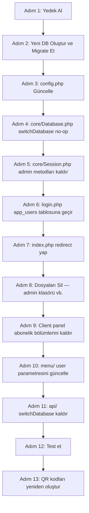

# QR MENÜ SİSTEMİ — MULTI-TENANT'TAN TEK FİRMA KURULUMUNA DÖNÜŞÜM PLANI

> **Versiyon:** 1.0  
> **Tarih:** 2026-04-22  
> **Hazırlayan:** Architect Mode — Otomatik Analiz  
> **Durum:** Uygulamaya Hazır

---

## İÇİNDEKİLER

1. [Veritabanı Dönüşüm Stratejisi](#1-veritabanı-dönüşüm-stratejisi)
2. [Dosya/Klasör Değişiklikleri](#2-dosyaklasör-değişiklikleri)
3. [Core Dosya Değişiklikleri](#3-core-dosya-değişiklikleri)
4. [Client Panel Değişiklikleri](#4-client-panel-değişiklikleri)
5. [Menu Sistemi Değişiklikleri](#5-menu-sistemi-değişiklikleri)
6. [API Değişiklikleri](#6-api-değişiklikleri)
7. [Login Sayfası Yeni Yapısı](#7-login-sayfası-yeni-yapısı)
8. [config.php Değişiklikleri](#8-configphp-değişiklikleri)
9. [Uygulama Adımları (Sıralı)](#9-uygulama-adımları-sıralı)
10. [Riskler ve Dikkat Edilecek Noktalar](#10-riskler-ve-dikkat-edilecek-noktalar)

---

## 1. Veritabanı Dönüşüm Stratejisi

### 1.1 Mevcut Durum

Sistem şu an iki ayrı veritabanı katmanına sahiptir:

```
qrmenu_main (Ana DB)
├── users               ← Tenant kayıtları
├── admins              ← Platform operatörü
├── subscriptions       ← Abonelik takibi
├── payments            ← Ödeme kayıtları
├── pricing             ← Fiyat planları
├── pricing_features    ← Plan özellikleri
├── settings            ← Sistem ayarları (SMTP vb.)
├── ui_translations     ← Arayüz çevirileri
├── ui_languages        ← Arayüz dilleri
├── landing_*           ← Landing page içeriği
├── login_attempts      ← Giriş deneme logları
└── email_logs          ← E-posta logları

user_1 (Her tenant için ayrı DB)
├── branches            ← Şube bilgileri
├── categories          ← Kategori bilgileri
├── category_branches   ← Kategori-şube ilişkisi
├── products            ← Ürün bilgileri
├── product_prices      ← Ürün fiyatları
├── translations        ← İçerik çevirileri
├── languages           ← Desteklenen diller
├── menu_settings       ← Menü tasarım ayarları
└── api_keys            ← API anahtarları
```

### 1.2 Hedef: Tek Birleşik Veritabanı

**Yeni veritabanı adı:** `qrmenu_app` (veya `qrmenu_firma` — config.php'de ayarlanacak)

#### 1.2.1 Tutulacak Tablolar (user_1'den gelenler — değişiklik yok)

| Tablo | Kaynak | Açıklama |
|-------|--------|----------|
| `branches` | user_1 | Şube bilgileri — olduğu gibi |
| `categories` | user_1 | Kategoriler — olduğu gibi |
| `category_branches` | user_1 | İlişki tablosu — olduğu gibi |
| `products` | user_1 | Ürünler — olduğu gibi |
| `product_prices` | user_1 | Fiyatlar — olduğu gibi |
| `translations` | user_1 | İçerik çevirileri — olduğu gibi |
| `languages` | user_1 | Diller — olduğu gibi |
| `menu_settings` | user_1 | Menü tasarımı — olduğu gibi |
| `api_keys` | user_1 | API anahtarları — olduğu gibi |

#### 1.2.2 Tutulacak Tablolar (qrmenu_main'den gelenler — sadeleştirilmiş)

| Tablo | Kaynak | Değişiklik |
|-------|--------|------------|
| `settings` | qrmenu_main | SMTP ve sistem ayarları için korunacak |
| `ui_translations` | qrmenu_main | Arayüz çevirileri — korunacak |
| `ui_languages` | qrmenu_main | Arayüz dilleri — korunacak |
| `email_logs` | qrmenu_main | E-posta logları — opsiyonel |
| `login_attempts` | qrmenu_main | Güvenlik için korunabilir |

#### 1.2.3 YENİ Tablo: `app_users` (login için)

`users` ve `admins` tabloları kaldırılacak. Bunların yerini basit bir `app_users` tablosu alacak:

```sql
CREATE TABLE IF NOT EXISTS `app_users` (
  `id`           INT(11) NOT NULL AUTO_INCREMENT,
  `username`     VARCHAR(100) NOT NULL UNIQUE,
  `email`        VARCHAR(255) NOT NULL UNIQUE,
  `password`     VARCHAR(255) NOT NULL COMMENT 'password_hash ile şifrelenmiş',
  `full_name`    VARCHAR(255) DEFAULT NULL,
  `is_active`    TINYINT(1) NOT NULL DEFAULT 1,
  `last_login`   TIMESTAMP NULL DEFAULT NULL,
  `created_at`   TIMESTAMP NOT NULL DEFAULT CURRENT_TIMESTAMP,
  `updated_at`   TIMESTAMP NULL DEFAULT NULL ON UPDATE CURRENT_TIMESTAMP,
  PRIMARY KEY (`id`)
) ENGINE=InnoDB DEFAULT CHARSET=utf8mb4 COLLATE=utf8mb4_unicode_ci;

-- Varsayılan kullanıcı (şifre: admin123 — kurulum sonrası değiştirilmeli!)
INSERT INTO `app_users` (`username`, `email`, `password`, `full_name`, `is_active`)
VALUES (
  'admin',
  'admin@firma.com',
  '$2y$10$YourHashedPasswordHere',  -- php -r "echo password_hash('admin123', PASSWORD_DEFAULT);"
  'Firma Yöneticisi',
  1
);
```

#### 1.2.4 Kaldırılacak Tablolar

Aşağıdaki tablolar yeni sistemde gereksizdir ve **silinecektir**:

```
users               ← app_users ile değiştirildi
admins              ← app_users ile birleştirildi
subscriptions       ← abonelik sistemi kaldırıldı
payments            ← ödeme sistemi kaldırıldı
pricing             ← fiyatlandırma kaldırıldı
pricing_features    ← fiyatlandırma kaldırıldı
landing_features    ← landing page kaldırıldı
landing_faqs        ← landing page kaldırıldı
landing_steps       ← landing page kaldırıldı
landing_settings    ← landing page kaldırıldı
landing_footer      ← landing page kaldırıldı
landing_translations ← landing page kaldırıldı
```

### 1.3 Migrasyon SQL Scripti

**Dosya:** `database/migrate_to_single.php`

```php
<?php
/**
 * Tek Firma Migrasyon Scripti
 * Çalıştırma: php database/migrate_to_single.php
 * ÖNCE: user_1 ve qrmenu_main veritabanlarının yedeğini alın!
 */
require_once __DIR__ . '/../config.php';

$mainPdo = new PDO("mysql:host=".DB_HOST.";charset=utf8mb4", DB_USER, DB_PASS, [
    PDO::ATTR_ERRMODE => PDO::ERRMODE_EXCEPTION
]);

$newDbName = 'qrmenu_app'; // config.php'de DB_NAME olacak

// 1. Yeni veritabanını oluştur
$mainPdo->exec("CREATE DATABASE IF NOT EXISTS `{$newDbName}` 
    CHARACTER SET utf8mb4 COLLATE utf8mb4_unicode_ci");
echo "✅ Veritabanı '{$newDbName}' oluşturuldu.\n";

// 2. user_1 tablolarını kopyala
$userTables = [
    'branches','categories','category_branches','products',
    'product_prices','translations','languages',
    'menu_settings','api_keys'
];
foreach ($userTables as $table) {
    $mainPdo->exec("CREATE TABLE IF NOT EXISTS `{$newDbName}`.`{$table}` 
        LIKE `user_1`.`{$table}`");
    $mainPdo->exec("INSERT INTO `{$newDbName}`.`{$table}` 
        SELECT * FROM `user_1`.`{$table}`");
    echo "✅ Tablo kopyalandı: {$table}\n";
}

// 3. qrmenu_main tablolarını kopyala
$mainTables = [
    'settings','ui_translations','ui_languages',
    'email_logs','login_attempts'
];
foreach ($mainTables as $table) {
    try {
        $mainPdo->exec("CREATE TABLE IF NOT EXISTS `{$newDbName}`.`{$table}` 
            LIKE `qrmenu_main`.`{$table}`");
        $mainPdo->exec("INSERT INTO `{$newDbName}`.`{$table}` 
            SELECT * FROM `qrmenu_main`.`{$table}`");
        echo "✅ Tablo kopyalandı: {$table}\n";
    } catch (Exception $e) {
        echo "⚠️  Tablo atlandı ({$table}): " . $e->getMessage() . "\n";
    }
}

// 4. app_users tablosunu oluştur
$mainPdo->exec("CREATE TABLE IF NOT EXISTS `{$newDbName}`.`app_users` (
  `id`        INT(11) NOT NULL AUTO_INCREMENT,
  `username`  VARCHAR(100) NOT NULL,
  `email`     VARCHAR(255) NOT NULL,
  `password`  VARCHAR(255) NOT NULL,
  `full_name` VARCHAR(255) DEFAULT NULL,
  `is_active` TINYINT(1) NOT NULL DEFAULT 1,
  `last_login` TIMESTAMP NULL DEFAULT NULL,
  `created_at` TIMESTAMP NOT NULL DEFAULT CURRENT_TIMESTAMP,
  `updated_at` TIMESTAMP NULL DEFAULT NULL ON UPDATE CURRENT_TIMESTAMP,
  PRIMARY KEY (`id`),
  UNIQUE KEY `username` (`username`),
  UNIQUE KEY `email` (`email`)
) ENGINE=InnoDB DEFAULT CHARSET=utf8mb4 COLLATE=utf8mb4_unicode_ci");

// Varsayılan admin kullanıcısı ekle
$hash = password_hash('admin123', PASSWORD_DEFAULT);
$stmt = $mainPdo->prepare(
    "INSERT INTO `{$newDbName}`.`app_users` 
     (username, email, password, full_name, is_active) 
     VALUES (?, ?, ?, ?, 1)"
);
$stmt->execute(['admin', 'admin@firma.com', $hash, 'Firma Yöneticisi']);
echo "✅ app_users tablosu ve varsayılan kullanıcı oluşturuldu.\n";
echo "\n⚠️  UYARI: admin123 şifresini hemen değiştirin!\n";
echo "✅ Migrasyon tamamlandı. config.php'de DB_NAME='{$newDbName}' olarak güncelleyin.\n";
```

### 1.4 FIRM_USER_ID Sabiti

Mevcut kodda `user_id` session'dan alınmakta ve `switchDatabase('user_' . $userId)` ile doğru DB'ye bağlanılmaktadır. Yeni sistemde bu dinamizme gerek kalmaz:

```php
// config.php'e eklenecek
define('FIRM_USER_ID', 1);  // Tüm işlemler bu ID ile yapılır
```

Bu sabit; client panel sayfaları, API ve menu sisteminde `Session::get('user_id')` yerine kullanılabilir veya session'dan gelen değer zaten 1 olacağından değişiklik minimal olur.

---

## 2. Dosya/Klasör Değişiklikleri

### 2.1 Silinecek Dosya ve Klasörler

Aşağıdaki klasör ve dosyalar **tamamen silinecektir**. Silmeden önce isteğe bağlı yedek alınabilir.

```
# Klasörler (tüm içerikleriyle)
admin/                          ← Platform admin paneli — TAMAMEN SİL

# Kök düzey dosyalar
register.php                    ← Kayıt sayfası — SİL
assets/css/register.css         ← Kayıt stili — SİL
assets/css/landing.css          ← Landing page stili — SİL
assets/js/landing.js            ← Landing page JS — SİL

# Cron
cron/trial_reminder.php         ← Trial hatırlatıcı — SİL

# E-posta şablonları (abonelik/ödeme ilgili)
email-templates/payment-approved.php      ← SİL
email-templates/payment-received-admin.php ← SİL
email-templates/payment-rejected.php      ← SİL
email-templates/trial-expiring.php        ← SİL
email-templates/subscription-expiring.php ← SİL

# Database scripti (user DB oluşturma — artık gerekli değil)
database/create_user_database.php         ← SİL (isteğe bağlı, arşivlenebilir)
```

### 2.2 Değiştirilecek Dosyalar (içeriği güncellenmeli)

```
index.php           ← Landing page → login.php'ye 301 redirect
login.php           ← admins tablosu yerine app_users tablosu
logout.php          ← admin_id session temizliği kaldırılacak
config.php          ← Bölüm 8'de detaylı açıklandı
core/Database.php   ← switchDatabase() pasif bırakılacak (Bölüm 3)
core/Session.php    ← requireAdmin(), isAdminLoggedIn() kaldırılacak (Bölüm 3)
core/Router.php     ← Subdomain mantığı kaldırılacak (Bölüm 3)
.htaccess           ← admin/ ve register.php yönlendirme kuralları kaldırılacak
```

### 2.3 Korunacak Dosya ve Klasörler (değişiklik yok)

```
client/             ← Client panel — TAM OLARAK KORUNACAK (bazı satır değişiklikleriyle)
menu/               ← QR menü görüntüleme — küçük değişiklikle korunacak
api/                ← API — küçük değişiklikle korunacak
core/               ← Temel sınıflar — sadeleştirme ile korunacak
email-templates/welcome.php  ← Hoş geldin maili — korunacak
cron/backup.php     ← Yedekleme — korunacak
uploads/branches/user_1/    ← Mevcut görseller — KORUNACAK
uploads/categories/user_1/  ← Mevcut görseller — KORUNACAK
```

### 2.4 index.php Yeni İçeriği

```php
<?php
// index.php — Landing page kaldırıldı, login'e yönlendir
header('Location: /login.php', true, 301);
exit;
```

**Neden 301?** Arama motorları varsa eski URL'yi kalıcı olarak yönlendirmiş olur.

---

## 3. Core Dosya Değişiklikleri

### 3.1 core/Database.php — Sadeleştirme

`switchDatabase()` metodu silinmeyecek ama **no-op (işlemsiz)** hale getirilecek. Bu sayede tüm `$db->switchDatabase(...)` çağrıları kod değişikliği olmadan çalışmaya devam eder, sadece hiçbir şey yapmaz.

**Neden silmiyoruz?** Client panel sayfalarında onlarca `$db->switchDatabase('user_' . $userId)` çağrısı var. Hepsini tek tek bulmak yerine metodu boş bırakmak çok daha güvenlidir.

```php
/**
 * @deprecated Tek firma kurulumunda gerekli değil — no-op olarak bırakıldı
 * Eski multi-tenant kod uyumluluğu için imza korunuyor
 */
public function switchDatabase($dbName) {
    // Tek veritabanı sistemi — geçiş yapılmaz, mevcut bağlantı kullanılır
    return; // no-op
}
```

Ayrıca `__construct()` içindeki `$dbName` parametresi artık sadece `DB_NAME` sabitini kullanır:

```php
public function __construct($dbName = null) {
    // $dbName parametresi geriye dönük uyumluluk için korundu
    // Tek firma sisteminde her zaman DB_NAME kullanılır
    $this->connect(DB_NAME);
    $this->currentDb = DB_NAME;
}
```

### 3.2 core/Session.php — Admin Metotları Kaldırılması

Aşağıdaki metotlar **kaldırılacak** veya `@deprecated` işaretlenecek:

```php
// KALDIRILACAK METOTLAR:
public static function isAdminLoggedIn()  // → artık kullanılmıyor
public static function requireAdmin()     // → artık kullanılmıyor
public static function adminLogout()      // → logout() alias'ı, kaldırılabilir

// KORUNACAK METOTLAR (değişiklik yok):
public static function isLoggedIn()       // user_id var mı kontrol eder
public static function requireClient()    // tek giriş noktası
public static function start()
public static function set() / get() / has() / remove()
public static function destroy() / logout()
public static function regenerateId()
public static function setFingerprint() / validateFingerprint()
```

**requireClient() sadeleştirilmiş hali:**

```php
public static function requireClient() {
    self::start();
    if (!isset($_SESSION['user_id'])) {
        header('Location: /login.php');
        exit;
    }
    // status ve branch_count kontrolü KALDIRILDI
    // Tek firma sisteminde bunlar anlamsız
}
```

**Session anahtarları — kaldırılanlar:**

Login sonrası artık session'a yazılmayacak olan anahtarlar:
- `admin_id` — admin sistemi kaldırıldı
- `admin_username` — kaldırıldı
- `user_type` — artık tek tip kullanıcı var, gerekmiyor
- `status` — abonelik durumu kaldırıldı
- `branch_count` — şube limiti kaldırıldı
- `subdomain` — subdomain sistemi kaldırıldı

**Session anahtarları — korunanlar:**

```php
Session::set('user_id',      $user['id']);    // Zorunlu — isLoggedIn() bunu kontrol eder
Session::set('username',     $user['username']);
Session::set('email',        $user['email']);
Session::set('full_name',    $user['full_name']);
```

### 3.3 core/Router.php — Pasif Hale Getirilmesi

`Router.php` **silinmeyecek** ama sınıf basitleştirilecek. Subdomain tespiti gereksiz; tüm metodlar sabit değerler döndürecek:

```php
<?php
/**
 * Router Sınıfı — Tek Firma Versiyonu
 * Subdomain yönlendirmesi kaldırıldı. Geriye dönük uyumluluk için sınıf korunuyor.
 */
class Router {
    private $subdomain = null;
    private $mainDomain;

    public function __construct() {
        $host = $_SERVER['HTTP_HOST'] ?? 'localhost';
        $this->mainDomain = $host;
        // Subdomain tespiti kaldırıldı — tek firma sisteminde gerekli değil
    }

    public function getSubdomain()  { return null; }
    public function getMainDomain() { return $this->mainDomain; }
    public function isAdmin()       { return false; }  // Admin yok
    public function isClient()      { return true;  }  // Her zaman client
    public function isMainSite()    { return false; }
}
```

---

## 4. Client Panel Değişiklikleri

### 4.1 Genel Kural: switchDatabase() Çağrıları

Tüm client sayfalarındaki şu pattern **artık işlevsiz ama zararsız**:

```php
// ESKI — her client sayfasında var (yaklaşık 15+ dosyada)
$userId = Session::get('user_id');
$db->switchDatabase('user_' . $userId);

// YENİ DURUM — switchDatabase() no-op olduğu için bu satırlar kalabilir
// ancak temizlik amaçlı silinmeleri önerilir
```

`switchDatabase()` no-op yapıldığında mevcut tüm kod çalışmaya devam eder. Temizlik isteğe bağlı ikinci bir adımda yapılabilir.

### 4.2 client/pages/subscription/ — TAMAMEN KALDIRILACAK

```
client/pages/subscription/list.php      ← SİL
client/pages/subscription/list.js       ← SİL
client/pages/subscription/list.css      ← SİL
client/pages/subscription/actions.php   ← SİL
```

Bu klasöre erişim denenirse 404 veya `/client/pages/dashboard/dashboard.php`'ye yönlendir.

### 4.3 client/pages/branches/actions.php — Branch Limit Kaldırma

Mevcut kodda şube ekleme sırasında şu kontrol bulunmaktadır:

```php
// ESKI KOD — KALDIRILACAK SATIRLAR
$branchCount = Session::get('branch_count');
$currentBranches = $db->single("SELECT COUNT(*) FROM branches WHERE deleted_at IS NULL");
if ($currentBranches >= $branchCount) {
    echo json_encode(['success' => false, 'message' => 'Şube limitine ulaştınız']);
    exit;
}
```

Bu blok **tamamen silinecek**. Şube ekleme artık limitsizdir.

### 4.4 client/pages/branches/list.php — Limit Uyarı Banner'ı

```php
// ESKI KOD — KALDIRILACAK
<?php if ($currentBranches >= $branchCount): ?>
<div class="alert alert-warning">
    Şube limitinize ulaştınız. Aboneliğinizi yükseltin.
</div>
<?php endif; ?>
```

Bu HTML bloğu silinecek.

### 4.5 client/pages/dashboard/dashboard.php — Abonelik Widget'ı

Dashboard'daki abonelik durum kartı (trial kalan gün, abonelik bitiş tarihi vb.) **silinecek**. İlgili PHP sorguları da kaldırılacak:

```php
// KALDIRILACAK sorgular
$subscription = $db->fetch("SELECT * FROM qrmenu_main.subscriptions WHERE user_id = ?", [$userId]);
$trialDaysLeft = ...; // trial hesaplama bloğu
```

### 4.6 client/components/sidebar/sidebar.php — Abonelik Menü Öğesi

```php
// KALDIRILACAK satırlar
<li class="nav-item">
    <a class="nav-link" href="/client/pages/subscription/list.php">
        <i class="fas fa-crown"></i> Abonelik
    </a>
</li>
```

### 4.7 client/pages/profile/profile.php — Abonelik Bilgileri

Profil sayfasında abonelik bilgisi gösteriliyorsa bu bölüm kaldırılacak. Firma adı, email, şifre değiştirme gibi temel özellikler **korunacak**.

### 4.8 client/pages/demo-data/ — KORUNACAK

Demo veri yükleme özelliği tek firma için de kullanışlıdır. Değişiklik gerekmez.

---

## 5. Menu Sistemi Değişiklikleri

### 5.1 Mevcut URL Yapısı

```
/menu/index.php?user=1&branch=2
/menu/products.php?user=1&branch=2&category=5
/menu/product-detail.php?user=1&branch=2&product=10
```

### 5.2 Yeni URL Yapısı

`user` parametresi kaldırılabilir. Sadece `branch` yeterlidir:

```
/menu/index.php?branch=2
/menu/products.php?branch=2&category=5
/menu/product-detail.php?branch=2&product=10
```

### 5.3 menu/index.php Değişikliği

```php
// ESKI
$userId   = (int)($_GET['user']   ?? 0);
$branchId = (int)($_GET['branch'] ?? 0);
if (!$userId || !$branchId) { /* hata */ }
$db->switchDatabase('user_' . $userId);

// YENİ
$branchId = (int)($_GET['branch'] ?? 0);
if (!$branchId) {
    // Tek şube varsa otomatik yönlendir
    $db = Database::getInstance();
    $firstBranch = $db->fetch("SELECT id FROM branches WHERE deleted_at IS NULL AND is_active=1 LIMIT 1");
    if ($firstBranch) {
        header('Location: /menu/index.php?branch=' . $firstBranch['id']);
        exit;
    }
    die('Menü bulunamadı.');
}
// switchDatabase() çağrısı kaldırıldı veya no-op olduğu için kalabilir
```

### 5.4 Geriye Dönük Uyumluluk (Önemli!)

Mevcut QR kodlar `?user=1&branch=X` formatındadır. Bu kodların çalışmaya devam etmesi için şu yönlendirme eklenebilir:

```php
// menu/index.php başına ekle
if (isset($_GET['user']) && isset($_GET['branch'])) {
    // Eski format — user parametresini yok say, sadece branch ile yönlendir
    header('Location: /menu/index.php?branch=' . (int)$_GET['branch'], true, 301);
    exit;
}
```

**Alternatif:** QR kodları yeniden oluşturmak yerine `user` parametresini kodda kabul etmeye devam et, sadece `switchDatabase()` çağrısını kaldır.

### 5.5 Upload Yolları

`menu/index.php` ve diğer menu dosyaları görsellere şu formatta erişir:

```php
// Mevcut
$logoPath = '/uploads/branches/user_' . $userId . '/' . $branch['logo_path'];

// Yeni — FIRM_USER_ID kullan
$logoPath = '/uploads/branches/user_' . FIRM_USER_ID . '/' . $branch['logo_path'];
```

---

## 6. API Değişiklikleri

### 6.1 api/v1/auth.php — Sadeleştirme

Mevcut API auth endpoint'i, `qrmenu_main.api_keys` tablosuna veya `user_` veritabanına bakıyor olabilir. Yeni sistemde:

```php
// ESKI pattern — kaldırılacak
$userId = ...; // user bazlı çözümleme
$db->switchDatabase('user_' . $userId);

// YENİ pattern
$db = Database::getInstance(); // Tek DB, geçiş yok
$apiKey = $db->fetch(
    "SELECT * FROM api_keys WHERE api_key = ? AND is_active = 1",
    [$requestKey]
);
```

### 6.2 api/v1/menu.php, categories.php, products.php

Her dosyadaki `switchDatabase()` çağrısı kaldırılacak veya no-op olduğu için dokunulmayacak.

URL parametresinden `user_id` çözümleme kaldırılacak:

```php
// ESKI
$userId = ...; // API key'den veya parametreden
$db->switchDatabase('user_' . $userId);

// YENİ — DB sabittir, user_id'ye gerek yok
$db = Database::getInstance();
```

### 6.3 api/check-subdomain.php

Bu dosya subdomain müsaitlik kontrolü için kullanılmaktaydı. **SİLİNECEK** (kayıt sistemi olmadığı için gerekli değil).

### 6.4 API Response'larında user_id

API response'larında `user_id` field'ı döndürülüyorsa, bu ya sabit `FIRM_USER_ID` değeri olarak kalabilir ya da response'dan kaldırılabilir. Breaking change olmayacak şekilde sabit değer bırakmak daha güvenlidir.

---

## 7. Login Sayfası Yeni Yapısı

### 7.1 login.php Değişiklikleri

Mevcut `login.php` iki ayrı tabloyu kontrol etmektedir: önce `admins`, sonra `users`. Yeni sistemde sadece `app_users` tablosu kontrol edilecektir.

```php
// ESKI — iki farklı tablo kontrolü
$stmt = $pdo->prepare("SELECT * FROM admins WHERE (email=? OR username=?) AND status='active'");
// ... admin girişi
$stmt = $pdo->prepare("SELECT * FROM users WHERE email=? AND deleted_at IS NULL AND status NOT IN ('deleted')");
// ... kullanıcı girişi

// YENİ — tek tablo kontrolü
$stmt = $pdo->prepare("
    SELECT * FROM app_users
    WHERE (username = ? OR email = ?)
    AND is_active = 1
    LIMIT 1
");
$stmt->execute([$login, $login]);
$user = $stmt->fetch(PDO::FETCH_ASSOC);

if ($user && password_verify($password, $user['password'])) {
    // Başarılı giriş
    Session::set('user_id',   $user['id']);      // Her zaman 1 olacak
    Session::set('username',  $user['username']);
    Session::set('email',     $user['email']);
    Session::set('full_name', $user['full_name'] ?? $user['username']);
    
    Session::regenerateId();
    Session::setFingerprint();
    CSRF::regenerate();
    
    $pdo->prepare("UPDATE app_users SET last_login = NOW() WHERE id = ?")
        ->execute([$user['id']]);
    
    header('Location: /client/pages/dashboard/dashboard.php');
    exit;
} else {
    $error = Lang::t('auth_error_invalid_credentials');
    // login_attempts kaydı...
}
```

### 7.2 login.php'den Kaldırılacak Bölümler

- Admin tablosu sorgusu (satır 84-117)
- `Session::set('user_type', 'admin')` ve `admin_id` atamaları
- `user_type === 'admin'` kontrolü ve `/admin/pages/dashboard/` yönlendirmesi
- Kullanıcı `status` kontrolü (`passive`, `cancelled` vb.)
- `Session::set('status', ...)` ve `Session::set('branch_count', ...)` atamaları
- `Session::set('subdomain', ...)` ataması
- Footer'daki kayıt linki: `<a href="/register.php">Kayıt Ol</a>` → kaldırılacak

### 7.3 Kurulum Scripti

**Dosya:** `database/setup_single_firm.php`

```php
<?php
/**
 * Tek Firma Kurulum Scripti
 * Yönetici kullanıcısını oluşturur veya günceller
 * Kullanım: php database/setup_single_firm.php
 */
require_once __DIR__ . '/../config.php';
require_once __DIR__ . '/../core/Database.php';

$db = Database::getInstance();

// Kullanıcı adı ve şifreyi burada ayarlayın
$username  = 'admin';
$email     = 'admin@firma.com';
$password  = 'GüçlüŞifre2026!';  // Değiştirin!
$fullName  = 'Firma Yöneticisi';

$hash = password_hash($password, PASSWORD_DEFAULT);

$existing = $db->fetch("SELECT id FROM app_users WHERE username = ?", [$username]);
if ($existing) {
    $db->query("UPDATE app_users SET email=?, password=?, full_name=?, is_active=1 WHERE username=?",
        [$email, $hash, $fullName, $username]);
    echo "✅ Kullanıcı güncellendi: {$username}\n";
} else {
    $db->insert('app_users', [
        'username'  => $username,
        'email'     => $email,
        'password'  => $hash,
        'full_name' => $fullName,
        'is_active' => 1,
    ]);
    echo "✅ Yeni kullanıcı oluşturuldu: {$username}\n";
}
echo "Login: {$username} / {$password}\n";
echo "⚠️  Bu scripti çalıştırdıktan sonra SİLİN!\n";
```

---

## 8. config.php Değişiklikleri

### 8.1 Kaldırılacak Sabitler

```php
// ABONELIK VE DENEME SÜRESİ — KALDIR
define('TRIAL_DAYS', 14);
define('SUBSCRIPTION_DAYS', 365);
define('DEFAULT_SINGLE_BRANCH_PRICE', 1500);
define('DEFAULT_PER_BRANCH_PRICE', 500);

// ÖDEME SİSTEMİ — KALDIR
define('BANK_NAME', ...);
define('BANK_ACCOUNT_NAME', ...);
define('BANK_IBAN', ...);
define('BANK_ACCOUNT_NUMBER', ...);
define('IYZICO_API_KEY', ...);
define('IYZICO_SECRET_KEY', ...);
define('IYZICO_BASE_URL', ...);

// ADMIN PANEL URL — KALDIR
define('ADMIN_URL', SITE_URL . '/admin');

// USER DB PREFIX — KALDIR
define('USER_DB_PREFIX', 'user_');

// KAYIT SİSTEMİ — KALDIR
define('REGISTRATION_ENABLED', true);

// LANDING PAGE — KALDIR (veya false bırak)
// (ayrı bir sabit yoksa bu satır doğrudan index.php'de)
```

### 8.2 Değiştirilecek Sabitler

```php
// VERİTABANI — GÜNCELLENECEk
define('DB_NAME', 'qrmenu_app');  // Yeni birleşik DB adı

// SİTE BİLGİLERİ — FİRMAYA GÖRE GÜNCELLENECEk
define('SITE_NAME', 'Firma Adı QR Menü');
define('SITE_SLOGAN', 'Dijital Menü Sistemi');
define('SITE_URL', 'https://firma.com');  // Gerçek domain
define('DOMAIN', 'firma.com');
```

### 8.3 Eklenecek Sabitler

```php
// TEK FİRMA MODU
define('FIRM_USER_ID', 1);          // Sabit kullanıcı ID
define('SINGLE_FIRM_MODE', true);   // Tek firma modunu işaret eder

// PARA BİRİMİ (isteğe bağlı — menü görüntüleme için)
define('CURRENCY', 'TRY');
define('CURRENCY_SYMBOL', '₺');
```

### 8.4 config.php'nin Yeni Şeması (Sadeleştirilmiş)

```php
<?php
// HATA RAPORLAMA
define('ENVIRONMENT', 'production');

// SİTE BİLGİLERİ
define('SITE_NAME', 'Restoran Adı');
define('SITE_URL', 'https://domain.com');
define('CLIENT_URL', SITE_URL . '/client');
define('MENU_URL', SITE_URL . '/menu');
define('API_URL', SITE_URL . '/api');

// VERİTABANI — TEK DB
define('DB_HOST', 'localhost');
define('DB_USER', 'db_kullanici');
define('DB_PASS', 'db_sifre');
define('DB_NAME', 'qrmenu_app');
define('DB_CHARSET', 'utf8mb4');

// TEK FİRMA
define('FIRM_USER_ID', 1);
define('SINGLE_FIRM_MODE', true);

// DİL
define('DEFAULT_LANGUAGE', 'tr');
date_default_timezone_set('Europe/Istanbul');
define('DATE_FORMAT', 'd.m.Y');
define('DATETIME_FORMAT', 'd.m.Y H:i');

// GÜVENLİK
define('SESSION_NAME', 'QRMENU_SESSION');
define('SESSION_LIFETIME', 7200);
define('SESSION_SECRET', 'rastgele_güçlü_bir_değer_buraya');
define('MIN_PASSWORD_LENGTH', 8);
define('CSRF_TOKEN_EXPIRE', 3600);
define('API_RATE_LIMIT', 150);
define('MAX_LOGIN_ATTEMPTS', 5);
define('LOGIN_BLOCK_TIME', 900);

// DOSYA YÜKLEME
define('MAX_FILE_SIZE', 10 * 1024 * 1024);
define('UPLOAD_DIR', __DIR__ . '/uploads');

// SMTP (DB'deki settings tablosundan da yüklenebilir)
define('SMTP_HOST', '');
define('SMTP_PORT', 587);
define('SMTP_USERNAME', '');
define('SMTP_PASSWORD', '');
define('SMTP_ENCRYPTION', 'tls');
define('SMTP_CIPHER_KEY', 'rastgele_güçlü_bir_değer');
define('MAIL_FROM_EMAIL', 'noreply@domain.com');
define('MAIL_FROM_NAME', 'Restoran Adı');

// QR KOD
define('QR_CODE_SIZE', 300);
define('QR_ERROR_CORRECTION', 'M');

// AZURE TRANSLATOR (isteğe bağlı)
define('AZURE_TRANSLATOR_KEY', '');
define('AZURE_TRANSLATOR_REGION', '');
define('AZURE_TRANSLATOR_ENDPOINT', 'https://api.cognitive.microsofttranslator.com/');

// YEDEKLEME
define('BACKUP_DIR', __DIR__ . '/backups');
define('BACKUP_RETENTION_DAYS', 30);

// AUTOLOADER
spl_autoload_register(function ($class) {
    $path = __DIR__ . '/core/' . $class . '.php';
    if (file_exists($path)) require_once $path;
});

// YARDIMCI FONKSİYONLAR (url, asset, formatCurrency, formatDate, e, dd)
// ... mevcut fonksiyonlar korunacak
```

---

## 9. Uygulama Adımları (Sıralı)

### Bağımlılık Akışı



---

### ADIM 1 — Yedek Al (Bağımlılık: Yok)

**⚠️ KRİTİK — Atlanamaz**

```bash
# phpMyAdmin veya mysqldump ile yedek al
mysqldump -u root -p qrmenu_main > backup_qrmenu_main_$(date +%Y%m%d).sql
mysqldump -u root -p user_1 > backup_user_1_$(date +%Y%m%d).sql

# uploads klasörünü de yedekle
cp -r uploads/ uploads_backup_$(date +%Y%m%d)/
```

---

### ADIM 2 — Yeni Veritabanı Oluştur ve Migrate Et (Bağımlılık: Adım 1)

```bash
php database/migrate_to_single.php
```

- `qrmenu_app` veritabanı oluşturulur
- `user_1` tabloları kopyalanır
- `qrmenu_main` settings/translations tabloları kopyalanır
- `app_users` tablosu oluşturulur, varsayılan kullanıcı eklenir

**Doğrulama:** phpMyAdmin'de `qrmenu_app` veritabanında tüm tablolar ve veri mevcut olmalı.

---

### ADIM 3 — config.php Güncelle (Bağımlılık: Adım 2)

- `DB_NAME` → `qrmenu_app`
- `FIRM_USER_ID` → `1`
- `SINGLE_FIRM_MODE` → `true`
- `ADMIN_URL`, `USER_DB_PREFIX`, `TRIAL_DAYS`, `SUBSCRIPTION_DAYS` sabitlerini sil
- Ödeme sabitlerini sil

**Doğrulama:** `php -l config.php` — syntax hatası olmamalı.

---

### ADIM 4 — core/Database.php — switchDatabase no-op (Bağımlılık: Adım 3)

`switchDatabase()` metodunu no-op yapın. `__construct()` içinden `DB_NAME` dışındaki parametre kullanımını kaldırın.

**Doğrulama:** `php database/api_debug.php` veya basit bir DB bağlantı testi.

---

### ADIM 5 — core/Session.php — Admin Metodları (Bağımlılık: Adım 3)

`isAdminLoggedIn()`, `requireAdmin()`, `adminLogout()` metodlarını kaldırın veya `@deprecated` işaretleyin.

**Doğrulama:** Projenin hiçbir yerinde `Session::requireAdmin()` kullanılmadığından emin olun:
```bash
grep -r "requireAdmin\|isAdminLoggedIn\|adminLogout" client/ menu/ api/ login.php
```

---

### ADIM 6 — login.php Güncelle (Bağımlılık: Adım 2, 3, 4, 5)

- `admins` tablosu sorgusunu kaldır
- `users` tablosu sorgusunu `app_users` ile değiştir
- Admin yönlendirmesini kaldır
- `status`, `branch_count`, `subdomain`, `user_type` session atamalarını kaldır

**Doğrulama:** Tarayıcıda `/login.php` açın, geçerli credentials ile giriş yapın, `/client/pages/dashboard/dashboard.php`'ye yönlenmeli.

---

### ADIM 7 — index.php Redirect (Bağımlılık: Adım 6)

`index.php` içeriğini sadece `header('Location: /login.php', true, 301); exit;` olarak değiştirin.

---

### ADIM 8 — Dosya Silme (Bağımlılık: Adım 6 tamamlandı, sistem çalışıyor)

```bash
# Admin klasörü
rm -rf admin/

# Kayıt dosyaları
rm register.php
rm assets/css/register.css
rm assets/css/landing.css
rm assets/js/landing.js

# Cron
rm cron/trial_reminder.php

# E-posta şablonları
rm email-templates/payment-approved.php
rm email-templates/payment-received-admin.php
rm email-templates/payment-rejected.php
rm email-templates/trial-expiring.php
rm email-templates/subscription-expiring.php

# API
rm api/check-subdomain.php
```

**⚠️ DİKKAT:** Silmeden önce her dosyanın başka bir yerde kullanılmadığından emin olun.

---

### ADIM 9 — Client Panel Abonelik Bölümleri (Bağımlılık: Adım 4, 8)

1. `client/pages/subscription/` klasörünü sil
2. `client/components/sidebar/sidebar.php`'den abonelik menü öğesini kaldır
3. `client/pages/branches/actions.php`'den branch limit kontrolünü kaldır
4. `client/pages/branches/list.php`'den limit banner'ını kaldır
5. `client/pages/dashboard/dashboard.php`'den abonelik widget'ını kaldır

**Doğrulama:** Her sayfayı tarayıcıda açarak kırık link veya PHP hatası olmadığını kontrol edin.

---

### ADIM 10 — menu/ Sistemi Güncelleme (Bağımlılık: Adım 2, 3, 4)

1. `menu/index.php`: `?user=N` parametresini kaldır veya geriye dönük uyumluluk redirect'i ekle
2. `menu/products.php`: aynı değişiklik
3. `menu/product-detail.php`: aynı değişiklik
4. Upload yollarındaki `user_` . `$userId` → `user_` . `FIRM_USER_ID`

**Doğrulama:** `http://localhost/menu/index.php?branch=1` açıldığında menü görünmeli.

---

### ADIM 11 — API Güncelleme (Bağımlılık: Adım 2, 3, 4)

1. `api/v1/auth.php`: `app_users` veya `api_keys` tablosundan doğrulama
2. `api/v1/menu.php`, `categories.php`, `products.php`: `switchDatabase()` çağrılarını kaldır (zaten no-op ama temizlik)
3. `api/v1/index.php`: user_id bazlı DB çözümlemeyi kaldır

**Doğrulama:** API endpoint'leri Postman/curl ile test edin.

---

### ADIM 12 — Kapsamlı Test (Bağımlılık: Tüm Adımlar)

Aşağıdaki senaryoları test edin:

- Login / Logout
- Şube ekleme, düzenleme, silme (limit olmadan)
- Kategori ekleme/düzenleme
- Ürün ekleme/düzenleme
- Çeviri yönetimi
- Dil ekleme
- Menü tasarımı kaydetme
- QR menü görüntüleme (`/menu/index.php?branch=1`)
- API endpoint'leri
- SMTP e-posta gönderimi
- Yedekleme (`cron/backup.php`)

---

### ADIM 13 — QR Kodları Yeniden Oluştur (Bağımlılık: Adım 10)

Eğer `?user=N` parametresi URL'lerden kaldırıldıysa, tüm şubelerin QR kodlarını yeni format ile yeniden oluşturun:

```php
// Yeni QR URL formatı
$qrUrl = SITE_URL . '/menu/index.php?branch=' . $branch['id'];
```

---

## 10. Riskler ve Dikkat Edilecek Noktalar

### 10.1 Mevcut Verinin Korunması ⚠️ KRİTİK

**Risk:** `user_1` veritabanındaki restoran verisinin migrasyon sırasında kaybolması.

**Önlem:**
- Migrasyon öncesi mutlaka `mysqldump` ile yedek alın
- `migrate_to_single.php` scripti veriyi kopyalar, orijinal veritabanına dokunmaz
- Migrasyon sonrası her tablodaki satır sayısını kaynak ile karşılaştırın:

```sql
-- Kontrol sorgusu
SELECT 'branches' as tablo, COUNT(*) as sayi FROM user_1.branches
UNION ALL
SELECT 'branches', COUNT(*) FROM qrmenu_app.branches;
-- Her iki sayı eşit olmalı
```

### 10.2 Upload Dosyaları

**Risk:** `uploads/branches/user_1/` ve `uploads/categories/user_1/` klasörleri; yeni sistemde `FIRM_USER_ID = 1` olduğundan yol değişmeyecek ve görseller çalışmaya devam edecek.

**Dikkat:** Eğer ileride kullanıcı ID'si 1'den farklı bir şeye ayarlanırsa upload yolları kırılır. `FIRM_USER_ID` sabitini asla değiştirmeyin.

**Upload klasörü yolu — değişiklik YOK:**
```
uploads/branches/user_1/   ← FIRM_USER_ID=1 olduğu için mevcut yol geçerliliğini korur
uploads/categories/user_1/ ← Aynı şekilde
```

### 10.3 API Anahtarları

`api_keys` tablosu `user_1` veritabanından kopyalanacağı için mevcut API anahtarları **korunacaktır**. Dışarıdan entegrasyon yapan sistemler (POS, mobil uygulama vb.) etkilenmez.

**Doğrulama:**
```sql
SELECT * FROM qrmenu_app.api_keys;
-- user_1'deki kayıtlar burada görünmeli
```

### 10.4 Session Çakışması

Migrasyon sırasında tarayıcıda açık oturumlar varsa `qrmenu_main.users` tablosuna yönelik session değerleri sorun çıkarabilir. Migrasyon sonrası:

```sql
-- Eğer session tablosu varsa temizle
-- PHP dosya bazlı session'larda gerek yok
```

Önerim: Migrasyon öncesi sunucudaki tüm session dosyalarını temizleyin:
```bash
rm -f /tmp/sess_*
# veya session.save_path nerede ise
```

### 10.5 .htaccess Kuralları

Mevcut `.htaccess` dosyasında admin subdomain yönlendirmesi veya register.php koruması olabilir. Kontrol edin:

```apache
# KALDIRILACAK kurallar (varsa):
RewriteRule ^register.php - [F,L]    # kayıt engeli — kaldır
RewriteCond %{HTTP_HOST} ^admin\.    # admin subdomain — kaldır
```

### 10.6 Cron Job'lar

Sunucuda tanımlı cron job'lar varsa kontrol edin:

```bash
crontab -l
# trial_reminder.php ve subscription cron'ları varsa kaldırın
# backup.php cron'u korunabilir
```

### 10.7 E-posta Şablonları ve Lang Anahtarları

`email-templates/welcome.php` korunacak. Ancak bu şablonda eski sistemden gelen `subscription_plan`, `trial_end_date` gibi değişkenler varsa bunları temizleyin.

### 10.8 ui_translations Tablosu — Admin ile İlgili Çeviriler

`ui_translations` tablosunda `scope='admin'` olan çeviri kayıtları artık kullanılmayacak ama zararsız olarak kalabilir. İsteğe bağlı temizlik:

```sql
-- İsteğe bağlı: admin scope çevirilerini sil
DELETE FROM ui_translations WHERE scope = 'admin';
```

### 10.9 Geriye Dönük Uyumluluk Matrisi

| Özellik | Mevcut | Yeni | Uyumluluk |
|---------|--------|------|-----------|
| `$db->switchDatabase()` | DB değiştirir | no-op | ✅ Kod değişikliği gerekmez |
| `Session::get('user_id')` | Dinamik | Her zaman 1 | ✅ Kod çalışır |
| `Session::requireClient()` | status/branch kontrolü var | Sadece login kontrolü | ✅ Daha basit |
| `?user=N&branch=M` URL'ler | Çalışır | Geriye uyumluluk redirect ile | ✅ Eski QR kodlar çalışır |
| API anahtarları | user bazlı | Aynı tablo, tek DB | ✅ Mevcut anahtarlar geçerli |
| Upload yolları | user_1/ | user_1/ (FIRM_USER_ID=1) | ✅ Değişiklik yok |

---

## Özet: Değişiklik Kapsamı

```
TOPLAM DEĞİŞTİRİLECEK DOSYA SAYISI (yaklaşık):
├── Silinecek: ~60+ dosya (admin/ klasörü dahil)
├── Yeni oluşturulacak: 2 dosya (migrate_to_single.php, setup_single_firm.php)
└── Değiştirilecek: ~15 dosya

KRİTİK DOSYALAR:
├── config.php          ← DB_NAME, yeni sabitler
├── login.php           ← app_users tablosu
├── core/Database.php   ← switchDatabase no-op
├── core/Session.php    ← admin metodları kaldır
└── menu/index.php      ← user parametresi kaldır

RİSK SEVİYESİ: DÜŞÜK
└── switchDatabase no-op yaklaşımı sayesinde
    client panel dosyalarına tek tek dokunmak gerekmez
```

---

*Bu plan Architect Mode tarafından kaynak kod analizi yapılarak otomatik oluşturulmuştur. Uygulama öncesinde Code Mode'a geçiş yapılması önerilir.*