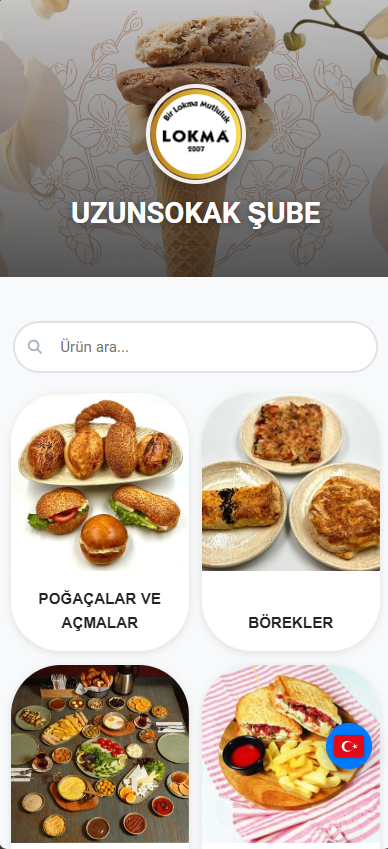
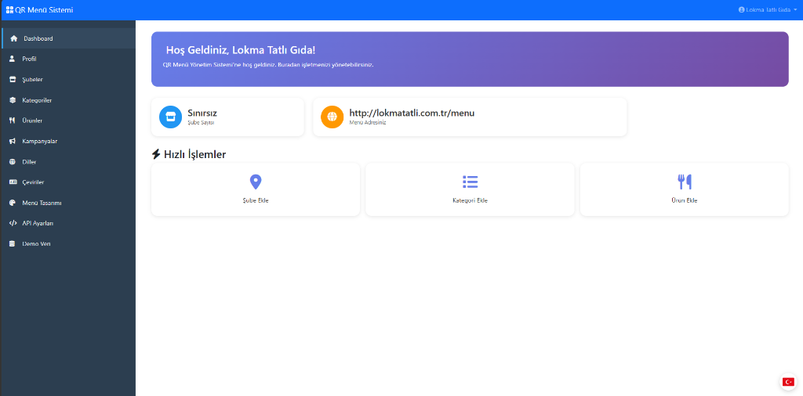
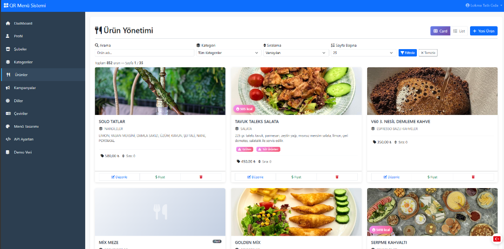

<div align="center">

# 🍽️ QR Menü Sistemi

### Restoran ve Kafeler için Dijital QR Menü Yönetim Platformu

**PHP** • **MySQL** • **Bootstrap 5** • **REST API**

[](https://php.net)
[](https://mysql.com)
[](https://getbootstrap.com)
[](LICENSE)

> ⚠️ **Bu proje özel mülkiyettir. Kaynak kod yalnızca portfolyo amaçlı sergilenmektedir.**  
> ⚠️ **This project is proprietary. Source code is displayed for portfolio purposes only.**

</div>

---

## 📋 Proje Hakkında / About

**QR Menü Sistemi**, restoran ve kafelerin müşterilerine QR kod üzerinden mobil uyumlu dijital menü sunmasını sağlayan, tam özellikli bir web tabanlı yönetim platformudur.

**QR Menu System** is a full-featured web-based management platform that enables restaurants and cafes to serve mobile-friendly digital menus to customers via QR codes.

> 💡 Proje **Lokma Tatlı Gıda** işletmesi için geliştirilmiş; **852+ ürün**, **çoklu şube** ve **çoklu dil** desteklemektedir. Mart 2026'da başlanıp Haziran 2026'da tamamlanmış ve canlıya alınmıştır.

---

## 📸 Gerçek Ekran Görüntüleri / Real Screenshots

### 📱 QR ile Açılan Müşteri Menüsü (Mobil)
> Müşteriler masadaki QR kodu taradığında bu sayfa açılır — şube adı, kategoriler ve ürünler listelenir.

<div align="center">

</div>

---

### 🖥️ Yönetim Paneli — Dashboard
> İşletme sahibi buradan şubeleri, menü adresini ve hızlı işlemleri yönetir.



---

### 📦 Ürün Yönetimi
> 852+ ürün kart ve liste görünümünde yönetilebilir. Kategori bazlı filtreleme, fiyat yönetimi ve şube bazlı görünürlük.



---

## 🌟 Özellikler / Features

| Özellik | Açıklama |
|---|---|
| 📱 **Mobil QR Menü** | QR tarandığında açılan hızlı, responsive müşteri menüsü |
| 🏪 **Çoklu Şube** | Her şube için ayrı menü, QR kod ve görünürlük ayarı |
| 🌍 **Çoklu Dil** | 8 dil desteği (TR, EN, DE, FR, ES, IT, RU, AR) + bayrak seçimi |
| 🔤 **Otomatik Çeviri** | Azure Translator ile içerik otomatik çevrilir |
| 📦 **Ürün Yönetimi** | Kart/liste görünümü, kategori filtresi, kalori, allerjen, fiyat |
| 🎨 **Menü Tasarımı** | Tema rengi, banner, logo, düzen özelleştirme |
| 🎯 **Kampanyalar** | Şubeye özel kampanya banner'ları |
| 🔌 **REST API** | JWT kimlik doğrulama + tam dokümanlı v1 API |
| 📊 **Admin Paneli** | Kullanıcı, ödeme ve abonelik yönetimi |
| 📧 **E-posta Bildirimleri** | SMTP + şablonlu otomatik e-posta sistemi |

---

## 🏗️ Mimari / Architecture

```
QRMenuProject/
│
├── 📁 admin/               # Süper Admin Paneli
│   ├── components/         # Navbar, Sidebar
│   └── pages/              # Dashboard, Kullanıcılar, Ödemeler, Fiyatlandırma,
│                           # SMTP, Yedekleme, Çeviriler, Landing Page Yönetimi
│
├── 📁 client/              # Yönetim Paneli (İşletme Sahibi)
│   ├── components/         # Navbar, Sidebar
│   └── pages/
│       ├── dashboard/      # Ana sayfa — şube sayısı, menü linki
│       ├── branches/       # Şube ekleme / düzenleme / silme
│       ├── categories/     # Kategori yönetimi (çeviri destekli)
│       ├── products/       # Ürün yönetimi (852+ ürün, resim, fiyat, allerjen)
│       ├── campaigns/      # Kampanya banner yönetimi
│       ├── languages/      # Aktif dil seçimi (8 dil)
│       ├── translations/   # Manuel çeviri düzenleme
│       ├── menu-design/    # Menü tema ve görünüm ayarları
│       ├── api-settings/   # REST API anahtar yönetimi
│       └── profile/        # Profil ve şifre güncelleme
│
├── 📁 menu/                # Müşteriye Açık QR Menü Sayfası
│   ├── index.php           # Ana menü (şube + kategoriler)
│   ├── products.php        # Ürün listesi
│   ├── product-detail.php  # Ürün detay sayfası
│   └── config/
│       └── translations.php # UI metinleri çeviri dosyası
│
├── 📁 api/v1/              # REST API
│   ├── auth.php            # JWT Authentication
│   ├── products.php        # Ürün CRUD
│   ├── categories.php      # Kategori CRUD
│   ├── branches.php        # Şube işlemleri
│   ├── menu.php            # Public menü endpoint
│   └── upload.php          # Görsel yükleme
│
├── 📁 core/                # Temel PHP Sınıfları
│   ├── Database.php        # PDO wrapper (switchDatabase destekli)
│   ├── Session.php         # Güvenli oturum yönetimi
│   ├── Router.php          # URL yönlendirme
│   ├── Mailer.php          # PHPMailer wrapper
│   ├── CSRF.php            # CSRF token koruması
│   ├── RateLimiter.php     # API rate limiting
│   ├── Lang.php            # UI çeviri yöneticisi (DB tabanlı)
│   └── Translator.php      # Azure Translator entegrasyonu
│
├── 📁 cron/                # Zamanlanmış Görevler
│   ├── backup.php          # Otomatik yedekleme
│   └── trial_reminder.php  # Deneme süresi hatırlatmaları
│
├── 📁 email-templates/     # E-posta Şablonları
│   ├── welcome.php
│   ├── payment-approved.php
│   └── subscription-expiring.php
│
├── config.example.php      # Örnek konfigürasyon (YOUR_* placeholder'lar)
└── .htaccess               # URL yönlendirme + güvenlik kuralları
```

---

## 🛠️ Teknoloji Stack / Tech Stack

### Backend
- **PHP 8.0+** — OOP, PDO, custom Router, sınıf tabanlı mimari
- **MySQL 8.0+** — Ana DB (kullanıcı/oturum) + Kullanıcı DB (ürün/kategori/şube)
- **Composer** — PHPMailer bağımlılığı
- **Apache** — `.htaccess` URL rewriting

### Frontend
- **Bootstrap 5.3** — Responsive, mobil öncelikli layout
- **Vanilla JavaScript** — AJAX, DOM, drag-drop sıralama
- **Chart.js** — Admin istatistik grafikleri
- **Font Awesome 6** — İkon seti

### 3rd Party Entegrasyonlar
- **Microsoft Azure Translator** — İçerik otomatik çeviri (8 dil)
- **PHPMailer** — SMTP e-posta (Outlook/Gmail/Hosting)
- **QR Code kütüphanesi** — Şubeye özel dinamik QR üretimi

---

## ⚙️ Kurulum / Installation

> [!IMPORTANT]
> Bu proje çalışmak için özel veritabanı yapılandırması ve konfigürasyon dosyası gerektirir.

```bash
# 1. Repoyu klonla
git clone https://github.com/celaltokmak61/QRMenuProject.git
cd QRMenuProject

# 2. Bağımlılıkları yükle
composer install

# 3. Konfigürasyonu ayarla
cp config.example.php config.php
# config.php içindeki YOUR_* değerlerini doldurun:
# - DB_HOST, DB_USER, DB_PASS, DB_NAME
# - SMTP_HOST, SMTP_USERNAME, SMTP_PASSWORD
# - AZURE_TRANSLATOR_KEY, AZURE_TRANSLATOR_REGION

# 4. uploads/ ve backups/ klasörlerine yazma izni ver
chmod 755 uploads/ backups/
```

> ⚠️ **Not:** Veritabanı şema dosyaları ve migration scriptleri bu repoda bulunmamaktadır.

---

## 📊 Proje İstatistikleri / Project Stats

| Metrik | Değer |
|---|---|
| 📅 Geliştirme Süresi | ~3 ay (Mart — Haziran 2026) |
| 📁 Toplam Dosya | 200+ |
| 💾 Veritabanı Tablosu | 25+ tablo |
| 🌍 Desteklenen Dil | 8 (TR, EN, DE, FR, ES, IT, RU, AR) |
| 📦 Yönetilen Ürün | 852+ ürün (gerçek kullanım) |
| 🏪 Şube Desteği | Çoklu şube, her biri ayrı QR |
| 📝 Toplam Satır | 15.000+ satır PHP |
| 🏷️ Versiyon | v30.0 |

---

## 🔐 Güvenlik / Security

- ✅ CSRF Token koruması (tüm form isteklerinde)
- ✅ SQL Injection koruması (PDO prepared statements)
- ✅ XSS koruması (`htmlspecialchars` her yerde)
- ✅ Rate Limiting (API'de dakikada 150 istek limiti)
- ✅ Brute-force koruması (5 başarısız giriş → 15 dk blok)
- ✅ Session hijacking koruması (fingerprinting)
- ✅ Güvenli dosya yükleme (MIME type + uzantı doğrulama)
- ✅ İki aşamalı yetkilendirme (Admin / Client rolleri)

---

## 👨‍💻 Geliştirici / Developer

**Celal Tokmak**  
📧 celaltokmakk@gmail.com  
🔗 [GitHub](https://github.com/celaltokmak61)

---

<div align="center">

**© 2026 Celal Tokmak. Tüm hakları saklıdır. / All rights reserved.**

*Bu yazılım özel mülkiyettir. İzinsiz kopyalanması, dağıtılması veya kullanılması yasaktır.*  
*This software is proprietary. Unauthorized copying, distribution, or use is prohibited.*

</div>
